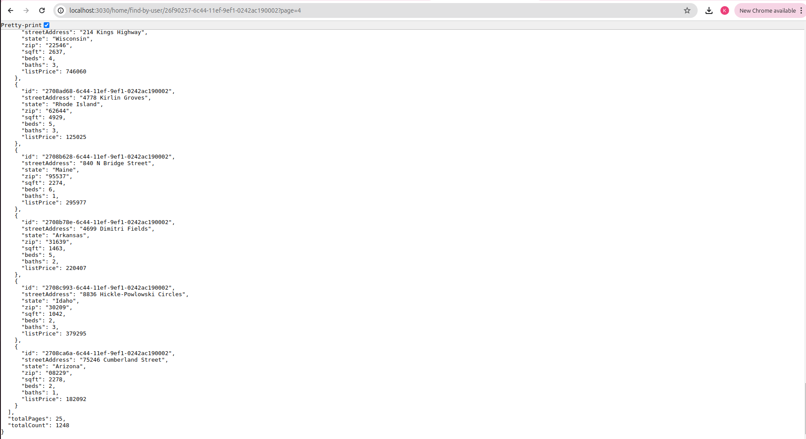

## How to run the Backend Assessment
1. Ensure that you have node installed on your machine
2. Ensure that you are inside the backend Directory
```
    cd backend
```
3. Install the libraries/dependencies
```
    npm install 
```
4. Run the Server to serve the frontend. Ensure that the local port '3030' is free, ie. no other service is running on this port.
```
    npm run start
```
## Techstack Used
1. Backend Node Framework
  - NestJs
2. Interacting with DB
  - TypeORM

## Solution Reached
1. Connecting with user, home and user_home_mapping table
2. Since, wanted to demonstrate normalization in scripts, created user_home_mapping table to map many to many relationan between user and home ie.
  - user has many homes
  - home belongs to many users
3. This bridging table can be easily managed using the typeorm's relationship management. However, since I explicitly created the table in the script, to showcase how, it is to be normalized used that establish the relation, hence the 3 entities.
4. Following are the endpoints created
  - /home/update-user (PUT)
    - successful update: 
      
    - validation failures:
      - invalid uuid (home)
        
      - id does not exist: no such home in db (home)
        
      - id does not exist: no such user in db (user)
        
      - invalid uuid (user)
        
      - similarly, invalid json also has been handled
  
  - /user/find-all (GET)
  

  - /home/find-by-user (GET) 
    - query with pagination, at a time 50 records will be fetched, hit
      /home/find-by-user/:userId?page=pageNo
    - if the id is not be be exposed, for security, it must be converted to POST 

    
  
  - /user/find-by-home (GET)
    
    - if the id is not be be exposed, for security, it must be converted to POST route


   

  


