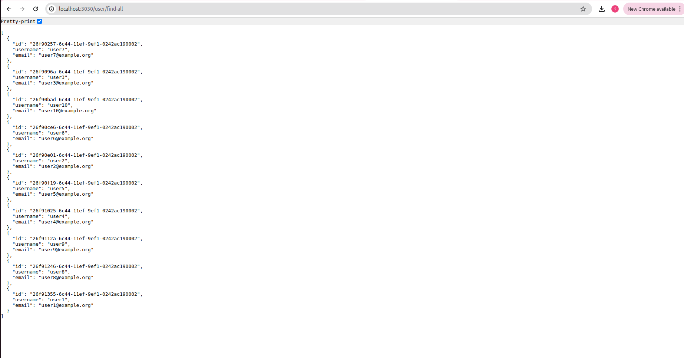

## How to run the Assessment
### Running the Application
#### Prerequisites
1. Ensure Docker and Docker Compose are installed on your machine.

2. Setup and Running Instructions
  - Clone the Repository
  - Navigate to the Root Directory   
    Ensure you're in the root directory where the docker-compose-orchestrate-services.yml file is located.
  - Build and Start the Containers
    ``` 
    docker compose -f docker-compose-orchestrate-services.yml up --build 

    ```
  - Verify the Services
    - Frontend: Open your web browser and navigate to http://localhost:3000 to view the frontend application.
    - Backend: The backend service should be available at http://localhost:3030.
    - MySQL: The MySQL database will be accessible on localhost:3306 from the host machine.

  - Stopping the Containers
    ```
    docker compose -f docker-compose-orchestrate-services.yml down

    ```
  - NOTE : There is no need to start and run the docker-compose.final.yml. The orchestration container takes care of the entire assessment container orchestration.


## Techstack Used
1. Backend Node Framework
  - NestJs
2. Interacting with DB
  - TypeORM

## Solution Reached
1. Connecting with user, home and user_home_mapping table
2. Since, wanted to demonstrate normalization in scripts, created user_home_mapping in the sql script, to map many to many relationan between user and home ie.
  - user has many homes
  - home belongs to many users
3. This bridging can be easily managed using the typeorm's relationship management. However, since I explicitly created the table in the script, to showcase how it is to be normalized, hence used that map the relation. Hence the 3 entities(user, home and user_home_mapping)
4. The directory structure of the code follows domain driven approach. 

5. Following are the endpoints created
  - /home/update-user (PUT)
    - successful update: 
      

    - handled validation of request, with response containing error bag:
      - invalid uuid (home)
        
      - id does not exist: no such home in db (home)
        
      - id does not exist: no such user in db (user)
        
      - invalid uuid (user)
        
        
      - similarly, invalid json also has been handled
  
  - /user/find-all (GET)
  

  - /home/find-by-user (GET) 
    - query with pagination, at a time 50 records will be fetched, hit
      /home/find-by-user/:userId?page=pageNo

    
  
  - /user/find-by-home (GET)
    


   

  


