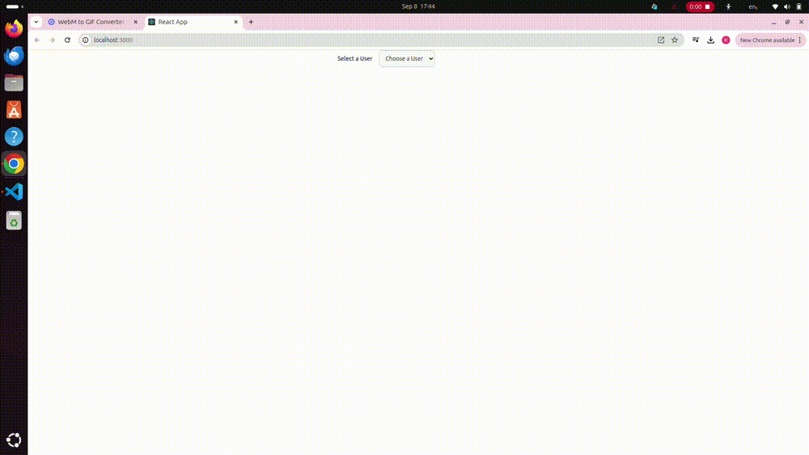
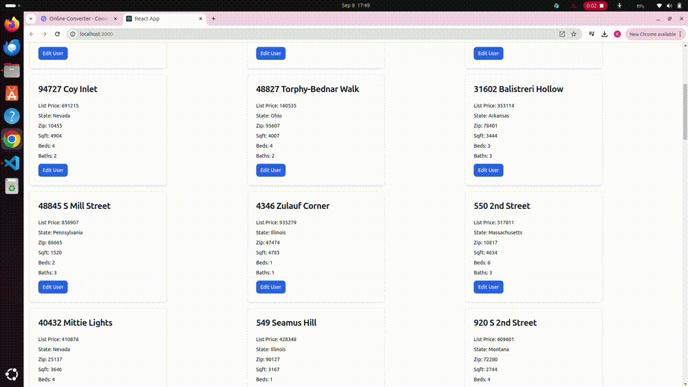

## How to Run the Frontend Application
## How to run the Assessment
### Running the Application
#### Prerequisites
1. Ensure Docker and Docker Compose are installed on your machine.

2. Setup and Running Instructions
  - Clone the Repository
  - Navigate to the Root Directory   
    Ensure you're in the root directory where the docker-compose-orchestrate-services.yml file is located.
  - Build and Start the Containers
    ``` 
    docker compose -f docker-compose-orchestrate-services.yml up --build 

    ```
  - Verify the Services
    - Frontend: Open your web browser and navigate to http://localhost:3000 to view the frontend application.
    - Backend: The backend service should be available at http://localhost:3030.
    - MySQL: The MySQL database will be accessible on localhost:3306 from the host machine.

  - Stopping the Containers
    ```
    docker compose -f docker-compose-orchestrate-services.yml down

    ```
  - NOTE : There is no need to start and run the docker-compose.final.yml. The orchestration container takes care of the entire assessment container orchestration.

## Techstack Used
1. JS Framework
    - create-react-app
2. CSS
    - Tailwind css
3. State Management
    - Redux Toolkit 
4. Data Fetching
    - RTK Query 
5. For skeletons/spinners
    - react-loading-skeleton

## Solution Reached
1. homes to be shown in cards after user select
    - Created central store containing state of users data (store/userSlice.js.js) recieved from the api and the selectedUser

    - The selectedUser changes whenever an option is selected from dropdown. The change in the central state triggers the    Home.jsx page to be reloaded with the updated selectedUser, leading to home/find-by-user/:userId api hit. The useEffect() in pages/Home.jsx, sets home state in store/homeSlice.js, orchestrating the components/CardList.jsx and components/Card.jsx to showcase proper data.

    - Created central store containing state of homes data (store/homeSlice.js) recieved from the api. 

    - Used RTK query (services/homeApi.js)  hitting home/find-by-user/:userId api

    - The RTK query library manages caching, giving a better response time

    - <


2. edit user functionality 
    - Used RTK query (services/userApi.js) for hitting /user/find-by-home api (services/homeApi.js - useGetAllHomesByUserQuery) and users for a home.

    - In order to identify which home is being edited, created a local state and passed it to the Modal. This ensures that only a  single Edit Modal exists in the DOM across application exists rather than seperate for each card, which is the correct approach.

    - Created a local state of checkedUsers in Modal. This helped ensure that atleast 1 checkbox remains checked and no un-necessary update is made, if there is no change.

    - On save hitting the home/update-users (PUT) api with the checkedUsersId and using the refetch() action provided by (services/homeApi.js - useGetAllHomesByUserQuery) passed to components/Modal.jsx as props from pages/Home.jsx
    

3. handle data-fetching properly
    - Used RTK Query to handing data-fetching

    - This ensured caching and error-handling

    - Used react-loading-skeleton while data is being fetched

4. bonus - handled pagination
    - handled pagination logic for fetching home cards (components/Pagination.jsx). Managed its state in (store/homeSlice.jsx)
    - 

